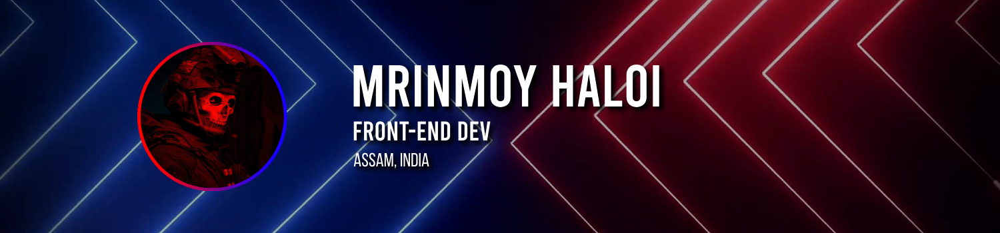

---

# Hi there 

I'm **Mrinmoy Haloi**, a Front End Developer from India. I specialize in creating user-friendly interfaces with **Svelte**, bringing designs to life with precision and efficiency. My passion for computers extends to my proficiency in **Linux**, where I navigate and operate with ease. 

## Technologies I use

<!-- html, css, scss, js, svelte, bootstrap, python, c++, vite, git, vscode, github, vercel, npm, prettier -->

## My Stats

|  |  |
|--|--|

## Socials

-   [Website](https://mrinmoy.is-a.dev)
-   [Twitter](https://twitter.com/MrinmoyHaloi)
-   [LinkedIn](https://www.linkedin.com/in/mrinmoy-haloi-9b8053290/)
-   Discord - mrinmoy.haloi

---

> The best thing about a boolean is even if you are wrong, you are only off by a bit
